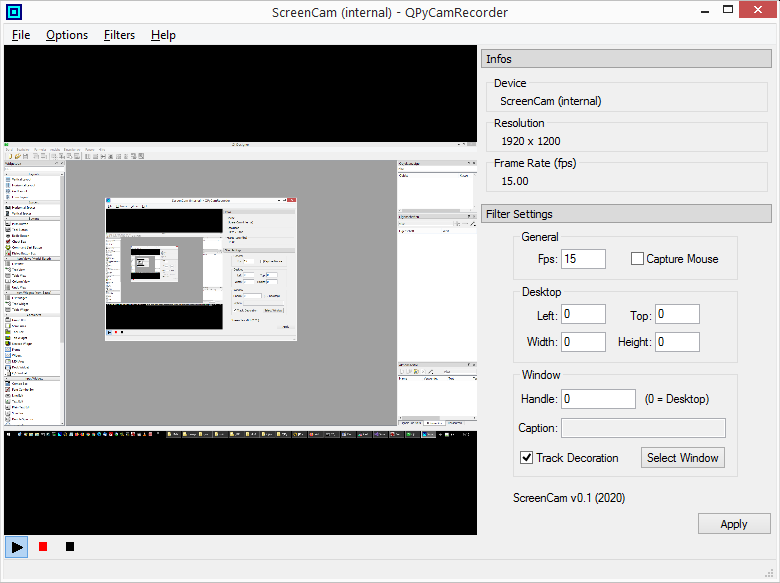

# ScreenCam
A virtual video input device (camera) for Windows that allows to capture the desktop or specific application windows.

[ScreenCam](https://github.com/59de44955ebd/ScreenCam) is a DirectShow source filter that implements a virtual camera. It's as fork of [screen-capture-recorder](https://github.com/rdp/screen-capture-recorder-to-video-windows-free), but with heavy modifications:

* It has a settings dialog that allows to adjust its capturing parameters. To capture a specific application window, you can press button "Select Window" in this dialog, and then interactively select the window by clicking on its title bar.

* It exposes a COM interface for getting and setting filter settings programmatically.

* The settings dialog can also be displayed outside of a DirectShow environment, by calling the filter DLL's Configure function, e.g. by running 

  C:\Windows\System32\rundll32.exe ScreenCam.dll,Configure
  
  in CMD/PowerShell or batch script.

* It uses different CLSIDs and registry keys than screen-capture-recorder, so the filters are independant.

* It supports 32, 24 and 16 bit RGB (but no YUV).

**Screenshots**

* ScreenCam integrated into [QPyCamRecorder](https://github.com/59de44955ebd/QPyCamRecorder):

  
